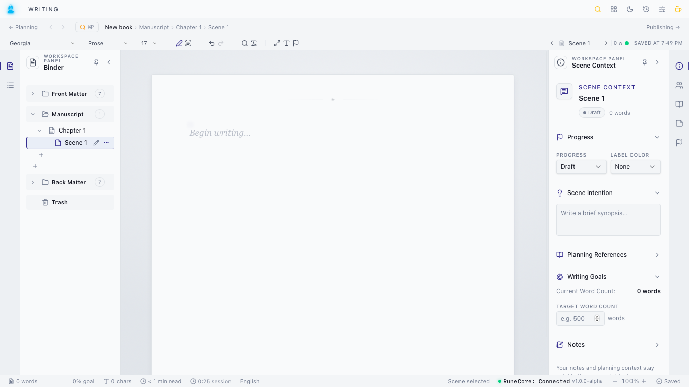
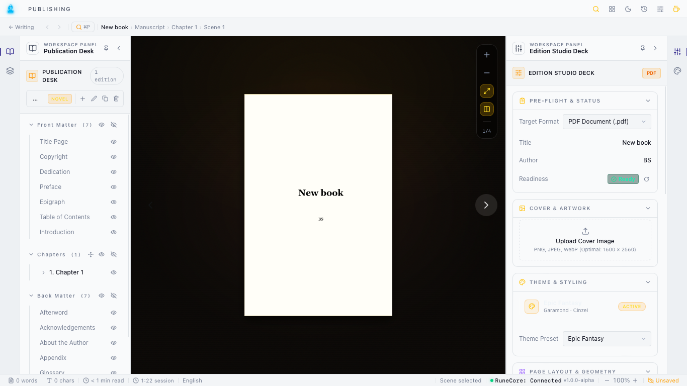
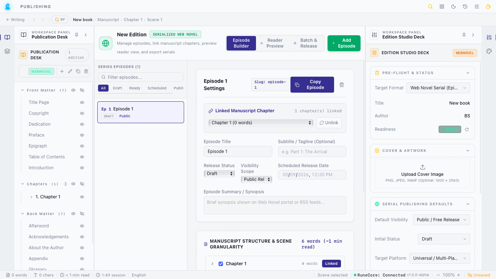

# ArgentForge Releases & Open Ecosystem

Welcome to the official public distribution hub for **[Booksmith Studio](https://argentforge.xyz)** and the **DarkQuill Reader**.

---

## 📢 Alpha Release v0.8.0 is Live!

Multi-platform alpha binaries are available for **macOS (Universal Intel & Apple Silicon)**, **Windows 10/11**, **Linux (AppImage/deb/rpm)**, and **Android (APK/AAB)**. Download verified installers directly from our **[Releases Tab](https://github.com/argentforge/releases/releases)**.

---

## 🖥️ Studio Showcase

### 1. The Writing Studio
Focus-driven manuscript drafting with a hierarchical binder (Front Matter, Chapters, Scenes, Back Matter), real-time scene context (writing goals, active cast references, intention notes), and local document state powered by the RuneCore engine.

---

### 2. Print & PDF Typesetting Studio
Live interactive book-block preview with realistic pagination, edition pre-flight readiness checks, cover artwork management, and typographical styling presets (Garamond, Cinzel, and custom themes).

---

### 3. Serialized Web Novel Studio
Episode-based serialization workflow for digital fiction and web platforms. Features one-click chapter-to-episode linking, release schedule planning (Draft, Scheduled, Public Release), and word count granularity.

---

## 🟢 Open-Source Core (`@argentforge/core`)
The fundamental data layer of the ArgentForge ecosystem is open-source under the **Apache 2.0 License**:  
👉 **Repository**: [https://github.com/argentforge/core](https://github.com/argentforge/core)

This package contains the complete **`.gyj` Open Document Specification**, TypeScript data models (Chapters, Scenes, Binder Nodes, Front-Matter), JSON serializers, and schema validators. It guarantees that authors retain 100% data ownership over their manuscripts with zero vendor lock-in.

---

## 🗺️ Structured Open-Source Roadmap
We believe in building software that authors and developers can trust for decades:

1. **Phase 1 (Live Now)**: The Open `.gyj` Document Models & Schema Serializers ([@argentforge/core](https://github.com/argentforge/core)).
2. **Phase 2 (Upcoming)**: The Official Website codebase and documentation portal.
3. **Phase 3 (Upcoming)**: The Booksmith Desktop Application UI and community CLI tools.

---

## 📦 Verified Installer Matrix

| Platform | Format | Recommended Architecture | Direct Download |
| :--- | :--- | :--- | :--- |
| 🍏 **macOS** | **Universal DMG** (`.dmg`) | macOS 12.0+ (Apple Silicon M1–M4 & Intel) | [Download .dmg](https://github.com/argentforge/releases/releases/latest) |
| 🪟 **Windows** | **Setup Installer** (`.exe`) / **MSI** | Windows 10 / 11 (64-bit) | [Download .exe](https://github.com/argentforge/releases/releases/latest) |
| 🐧 **Linux** | **AppImage** / **.deb** / **.rpm** | Universal Linux Distributions | [Download AppImage](https://github.com/argentforge/releases/releases/latest) |
| 🤖 **Android** | **Standalone APK** (`.apk`) | Android 6.0+ Phones & Tablets | [Download .apk](https://github.com/argentforge/releases/releases/latest) |

---

## 🛡️ License & Data Sovereignty
Booksmith and DarkQuill are distributed under the **[ArgentForge Free Application License](https://argentforge.xyz)** — 100% Free for personal and commercial publishing with zero royalties and zero telemetry.

- **Official Website**: [https://argentforge.xyz](https://argentforge.xyz)
- **Bug Reports & Feedback**: [GitHub Issues Tracker](https://github.com/argentforge/releases/issues)
